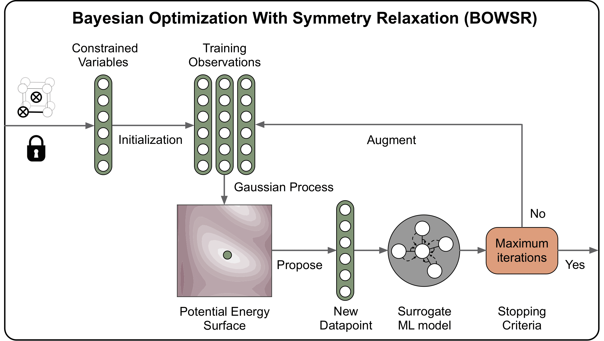

## Bayesian Optimization With Symmetry Relaxation Algorithm (BOWSR)

The BWOSR app is designed for obtaining near-equilibrium crystal structures via
bayesian optimization and graph deep learning energy model without expensive
DFT. The current implementation is compatible with energy evaluators
for [MEGNet](https://github.com/materialsvirtuallab/megnet)
, [CGCNN](https://github.com/txie-93/cgcnn), and [VASP](https://www.vasp.at).

# Algorithm

The BOWSR algorithm parameterizes each crystal based on the independent lattice
parameters and atomic coordinates based on its space group. The potential
energy surface is then approximated by initializing a set of training
observations and energies from the ML energy model. Bayesian optimization is
then used to iteratively propose lower energy geometries based on prior
observations.

<strong>Figure 1. Bayesian Optimization With Symmetry Relaxation (BOWSR) algorithm.</strong>

# Usage

By default, the current implementation uses the pre-trained graph models
in [MEGNet-2019](https://github.com/materialsvirtuallab/megnet/tree/master/mvl_models/mp-2019.4.1)
and [CGCNN-2018](https://github.com/txie-93/cgcnn/tree/master/pre-trained).
Please visit the [notebooks directory](../../../notebooks/bowsr) for Jupyter
notebooks with more detailed code example.